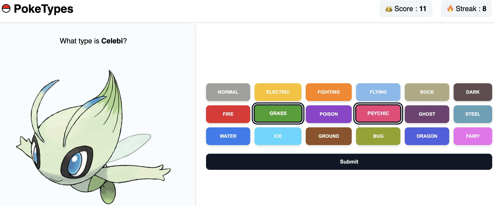

# 🔴 Poketypes
Can you guess the pokemon's type(s) based on its sprite? (I promise it's fun)

Built with Angular.

---

## 💻 Interface
<p align="center">
  
</p>

---

## 📁 Project structure

```
poketypes/
├── README.md
├── angular.json
├── package-lock.json
├── package.json
├── public
│   └── pokicon.png
├── src
│   ├── app
│   │   ├── app.config.ts
│   │   ├── app.html
│   │   ├── app.routes.ts
│   │   ├── app.scss
│   │   ├── app.spec.ts
│   │   ├── app.ts
│   │   ├── components
│   │   │   ├── game-result
│   │   │   │   ├── game-result.html
│   │   │   │   ├── game-result.scss
│   │   │   │   ├── game-result.spec.ts
│   │   │   │   └── game-result.ts
│   │   │   ├── header
│   │   │   │   ├── header.html
│   │   │   │   ├── header.scss
│   │   │   │   ├── header.spec.ts
│   │   │   │   └── header.ts
│   │   │   └── type-selector
│   │   │       ├── type-selector.html
│   │   │       ├── type-selector.scss
│   │   │       ├── type-selector.spec.ts
│   │   │       └── type-selector.ts
│   │   ├── data
│   │   │   └── types.ts
│   │   ├── game
│   │   │   ├── game.html
│   │   │   ├── game.scss
│   │   │   ├── game.spec.ts
│   │   │   └── game.ts
│   │   ├── models
│   │   │   ├── game-status.ts
│   │   │   ├── pokemon-api.ts
│   │   │   ├── pokemon.ts
│   │   │   └── type.ts
│   │   └── services
│   │       ├── poke-api.spec.ts
│   │       └── poke-api.ts
│   ├── index.html
│   ├── main.ts
│   └── styles.scss
├── tsconfig.app.json
├── tsconfig.json
└── tsconfig.spec.json
```
---

## ⚙️ Development server

To start a local development server, run:

```bash
ng serve
```

Once the server is running, open your browser and navigate to `http://localhost:4200/`.
